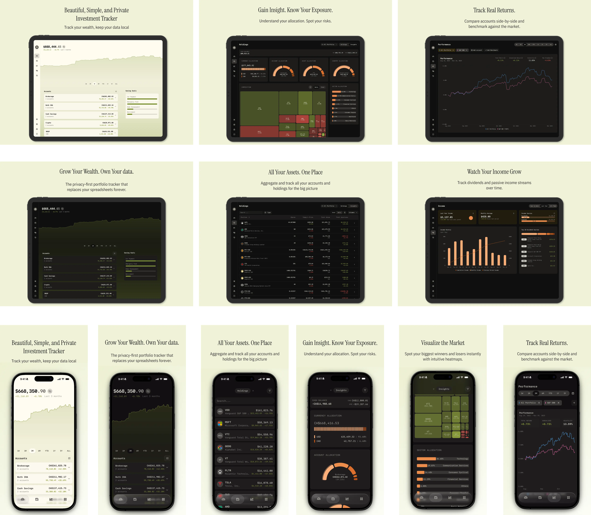

<div align="center">
  <a href="https://github.com/galza-guo/Panorama">
    
  </a>

  <h1>Panorama</h1>

  <p><strong>面向港股 / A 股 / 全球资产的本地优先财富追踪工具</strong></p>
  <p><strong>Local-first wealth tracker for HK/CN and global portfolios</strong></p>
  <p><strong>Forked from Wealthfolio · 基于 Wealthfolio 的分叉项目</strong></p>

  <p>
    <a href="README.en.md">English README</a>
    ·
    <a href="https://github.com/galza-guo/Panorama/releases">Releases</a>
    ·
    <a href="ROADMAP.md">Roadmap</a>
    ·
    <a href="https://github.com/galza-guo/Panorama/issues">Issues</a>
    ·
    <a href="https://github.com/afadil/wealthfolio">Upstream Wealthfolio</a>
  </p>
</div>

> [!IMPORTANT]
> **Panorama 是 Wealthfolio 的社区分叉项目。**
> **Panorama is a community fork of Wealthfolio.**
>
> 它不是 Wealthfolio 官方发行版，而是在上游基础上持续维护、发布和本地化增强的独立项目。
> It is not the official Wealthfolio distribution; it is an independently maintained fork with localized enhancements.



## 项目定位

Panorama 基于 Wealthfolio v3 演进，保留了本地优先、SQLite、本机数据掌控和可扩展插件体系，同时把重心放在更贴近中文用户的实际使用场景：港股、A 股、中国基金，以及定存、保险、MPF 等更容易在现实生活里长期持有、却常被通用记账工具忽略的资产工作流。

这个仓库是 Panorama 的主要维护入口，集中放置发行版本、问题追踪、文档和与上游同步相关的说明。

## 为什么做这个 fork

- 保留 Wealthfolio 简洁、本地优先的核心方向
- 为 HK/CN 市场补齐更顺手的数据与符号处理，以及更可用的中国资产价格更新
- 在不破坏上游兼容性的前提下，扩展定存、保险、MPF 等资产流程
- 延续上游 AI Assistant，并补入 `DeepSeek` 提供方支持
- 给多设备、家庭协作理财补上更实际的同步方案，尤其是桌面端共享文件夹同步
- 继续兼容 Wealthfolio v3 addon API，方便沿用现有扩展思路

## Panorama 的几个重点增强

- **中国资产覆盖更完整**：除了通用市场数据能力，也补上更本地化的 A 股、港股、中国基金数据路径；仓库内已集成 `EastmoneyCnProvider`。
- **定存不是只能手工记一笔**：Time Deposit 可以按利率或到期价值推算当前价值，并显示到期相关信息，适合记录定存和一类固定收益资产。
- **专门资产不是边角功能**：保险和 MPF 都有单独工作流，MPF 还带有单位净值同步能力。
- **同步更贴近日常使用**：桌面端提供基于共享文件夹的同步流程，适合配合 `Syncthing` 这类工具做多设备或家庭共管。
- **AI 助手继续可用，而且更接地气**：沿用上游 AI Assistant，同时加入 `DeepSeek` API 支持。

## 核心能力

- 多账户、多资产、多币种组合追踪
- 收益表现、历史走势与资产配置回顾
- 港股、A 股、中国基金等本地化市场覆盖
- 定存可按利率或到期价值估算当前价值，并跟踪到期信息
- 保险、MPF 等专门资产工作流，含 MPF 单位净值同步
- AI Assistant 与 `DeepSeek` 提供方支持
- 桌面端共享文件夹同步，适合 Syncthing 场景
- 桌面端与 Web 模式共用核心业务逻辑
- Addon 系统、TypeScript SDK 与开发工具链
- 本地存储优先，不依赖云端保存你的财务数据

## 适合谁

- 主要投资港股、A 股、基金，同时也持有全球资产的个人投资者
- 希望把财务数据留在本地，而不是托管到第三方云服务的人
- 需要记录保险、MPF 或其他常见投资记账工具不太照顾到的资产类型的用户
- 需要两个人或多台设备一起看账、一起维护投资记录的家庭或伴侣

## 快速开始

先准备好 `Node.js`、`pnpm`、`Rust` 和 `Tauri`，然后：

```bash
git clone https://github.com/galza-guo/Panorama.git
cd Panorama
pnpm install
cp .env.example .env
pnpm tauri dev
```

常用命令如下：

| 目标 | 命令 |
| --- | --- |
| 桌面开发 | `pnpm tauri dev` |
| Web 开发 | `pnpm run dev:web` |
| 前端测试 | `pnpm test` |
| Rust 测试 | `cargo test` |
| 类型检查 | `pnpm type-check` |
| 全量检查 | `pnpm check` |

如果你要跑 Web 模式，建议先把 `.env.web.example` 复制成 `.env.web` 再执行 `pnpm run dev:web`。

如果你是在开发 addon，可以从 [Addon Documentation Hub](docs/addons/index.md) 开始。

## 文档入口

- [活动类型说明](docs/activities/activity-types.md)
- [Addon 文档总览](docs/addons/index.md)
- [适配层架构说明](docs/architecture/adapters.md)
- [项目路线图](ROADMAP.md)
- [品牌与上游归属说明](TRADEMARKS.md)

## 开源与归属

- License: [AGPL-3.0](LICENSE)
- Upstream: [afadil/wealthfolio](https://github.com/afadil/wealthfolio)
- Panorama 保持 `Panorama` 作为对用户可见的产品名；部分内部标识会继续保留 `Wealthfolio` 命名，以降低上游同步成本并保持兼容性。

## 致谢 / Acknowledgement

Panorama 建立在 Wealthfolio 的基础之上，也会持续明确标注这层上游关系。感谢 [Wealthfolio](https://github.com/afadil/wealthfolio) 这个上游开源项目提供起点。

Panorama is built on top of Wealthfolio, and we intend to keep that provenance visible. Thanks to the Wealthfolio project for making that upstream foundation available.

`Wealthfolio` is a trademark of Teymz Inc. See [TRADEMARKS.md](TRADEMARKS.md) for attribution and branding guidance.
